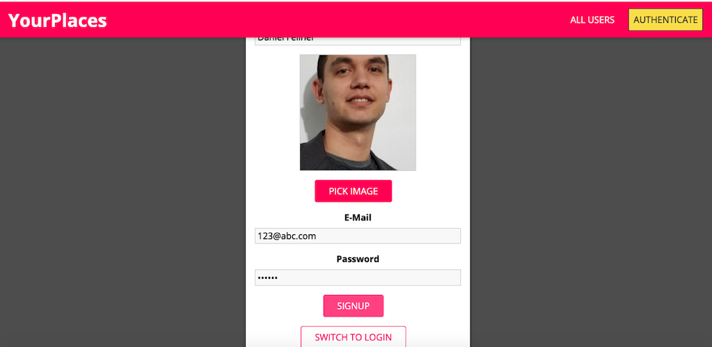

# PlaceSpace

### Overview (two sentences)

### Purpose 

Upon graduating from Rutgers Coding Bootcamp, I wished to expand upon my knowledge of React and node.js, particularly in terms of having a better understanding of RESTful APIs. This app, produced through ...... , gave me a better understanding of Mongo, React hooks, as well as a deeper understanding of data and how it can be stored (e.g. converting binary to static to add to a file)

![Image of ]

### Technologies 
- React
    + react transition group
    + react router dom
    + custom hooks
    + native hooks
- Mongo Atlas
- Node.js
- Express.js
- Bcrypt.js
- .env
- jsonwebtoken

### Future Improvements

- Hosting the app with a more elaborate hosting service/plan, as the free heroku plan that currently hosts the platform doesn't save images within files.
-

### Links

- [Application](https://backend-placespace.herokuapp.com)
