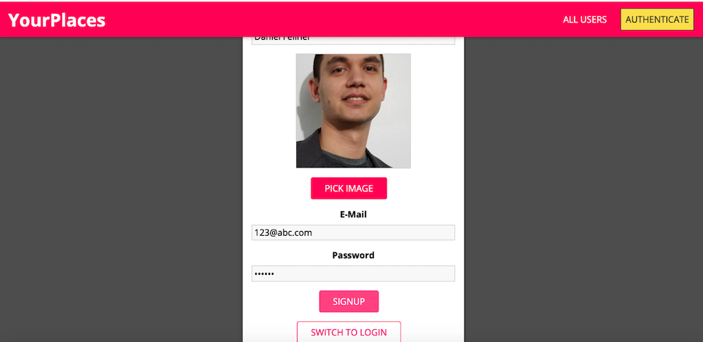
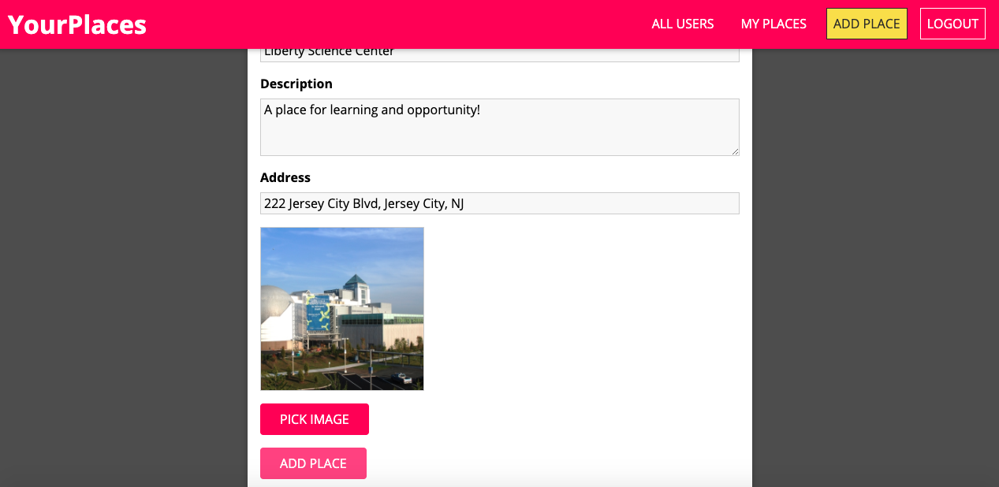
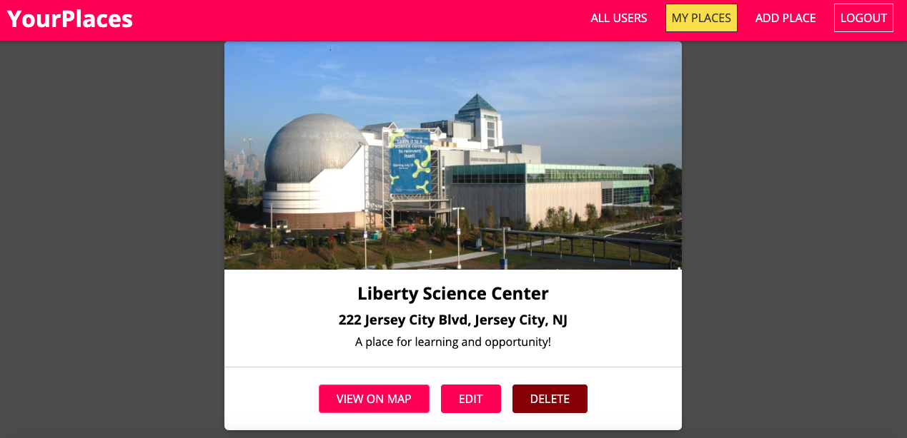
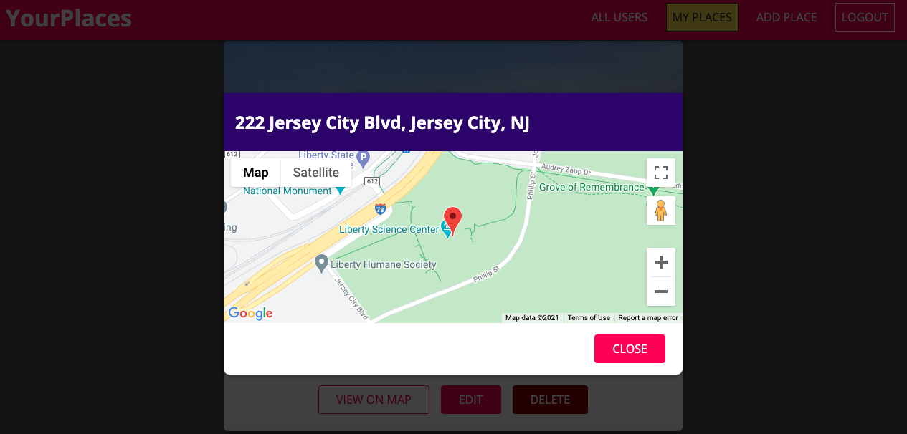
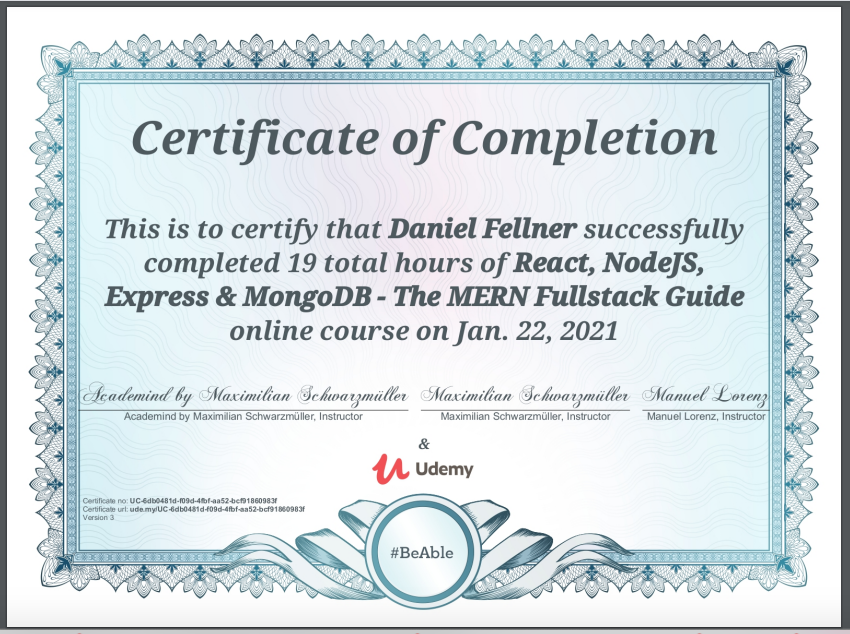

# PlaceSpace

### Overview

This app allows for the user to log in with basic authentication, post and view places, as well as the abilities to upate and delete one's own places. Additionally, the user can view posted places located on Google Maps. 

##### Signup

##### Loading Page

##### Adding Places

##### Viewing Place

##### Google Maps API

### Purpose 

Upon graduating from Rutgers Coding Bootcamp, I wished to expand upon my knowledge of React and node.js, particularly in terms of having a better understanding of RESTful APIs. This app, produced through The MERN Fullstack Guide by Acadamind, gave me a better understanding of Mongo, React hooks, as well as a deeper understanding of data and how it can be stored (e.g. converting binary to static to add to a file)

### Technologies 
- React
    + react transition group
    + react router dom
    + custom hooks
    + native hooks
- Mongo Atlas
- Node.js
- Express.js
- Bcrypt.js
- .env
- jsonwebtoken

### Future Improvements

- Hosting the app with a more elaborate hosting service/plan, as the free heroku plan that currently hosts the platform doesn't save images within files.
- Incorporating a GraphQL component for the backend to allow for relational data to be accessed/shared. 

### Links

- [Application](https://backend-placespace.herokuapp.com)
